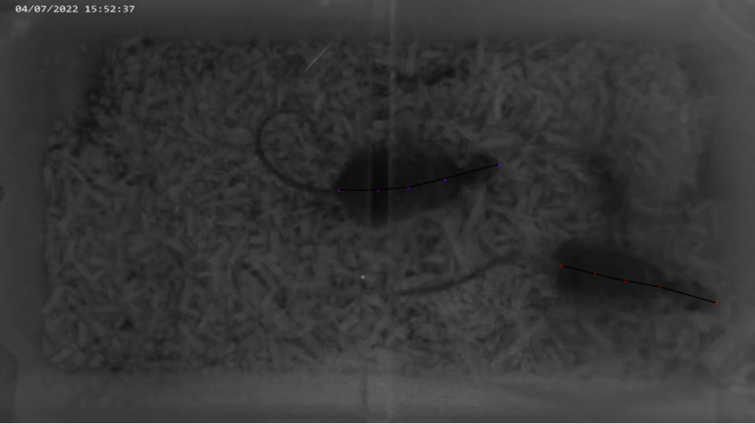
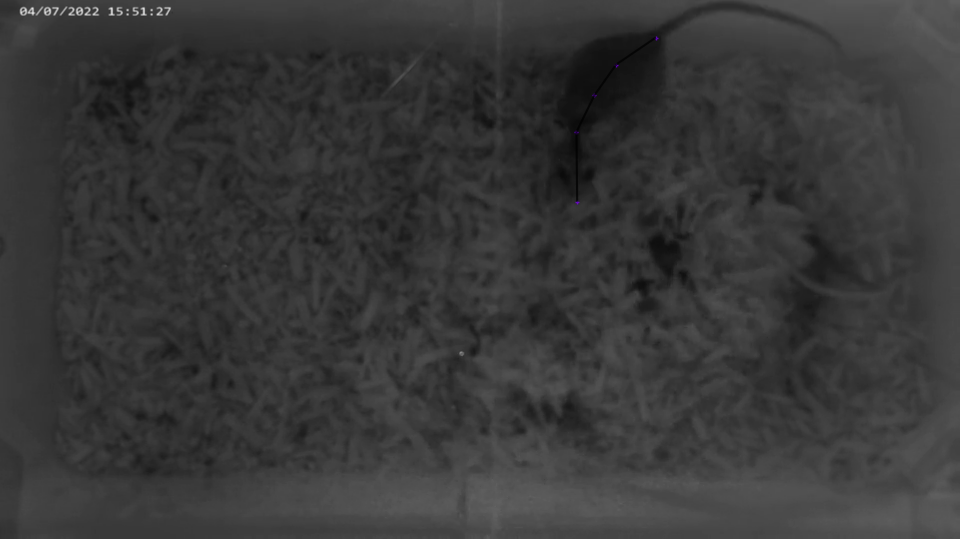
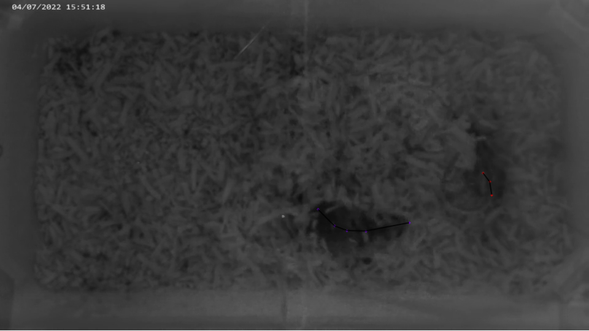
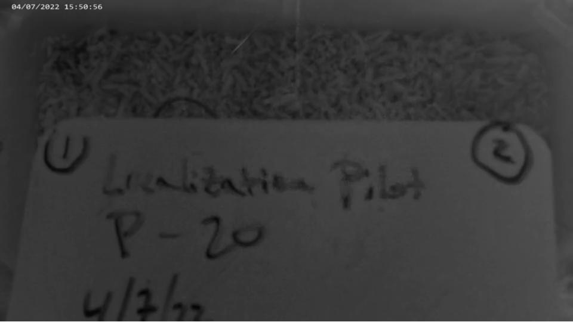
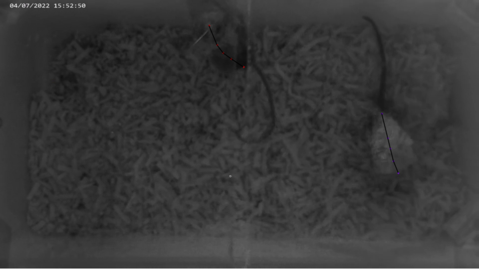

# How to Label

### Overview

Labeling process is crucial because consistent data decide the performance of trained model.
The documentation will guide us through general labeling prcoess and how to label data consistently.

### Run DeepLabCut

##### Step to open labelling GUI
* Open Anaconda Prompt
* move to project directory by typing “cd Desktop\CaliforniaMouseDLC”
* activate DLC environment by typing “conda activate DEEPLABCUT”
* run program by typing “python dlc_label.py”

##### Step to label
* press “load label” left bottom corner
* search for directory containing train data (It should look like the attached photo) and press “select folder”
* press right click to start labelling and right arrow key to go to the next image (details on labelling, click “help” button for more detail)
* make sure to save frequently because program could crash sometimes
* once finish labelling set, press “save” button and then “quit” button (“quit” button may not show up, then maximize the window of the GUI)
* if you have other image set to label, click “yes” on the dialog window and repeat 1-6 steps or “no” otherwise

### Data Label

For the purpose of our reserach, two mice and their bodyparts are labeled for each frame.
* mouseA
  - a
  - b
  - c
  - d
  - e
  
* mouseB
  - a
  - b
  - c
  - d
  - e

Consistent data is the most important aspect of training a model.
A 1000 diverse frames are sampled from videos, so it will be often the case it is difficult to locate their bodyparts.
Here, we need to decide if we label their approximate location or do not label at all.
This we will learn from looking at examples

### Examples
<figure class="image">
    
    <figcaption>Normally all bodyparts are visible.</figcaption>
</figure>
<figure class="image">
    
    <figcaption>A mouse on the right is completely hidden. Only label the mouse on the left.</figcaption>
</figure>
<figure class="image">
    
    <figcaption>A mouse on the right is partially hiding. Label only visible body parts.</figcaption>
</figure>
<figure class="image">
    
    <figcaption>There is no mice found so should not label.</figcaption>
</figure>
<figure class="image">
    
    <figcaption>One mouse is standing. Label their spine.</figcaption>
</figure>